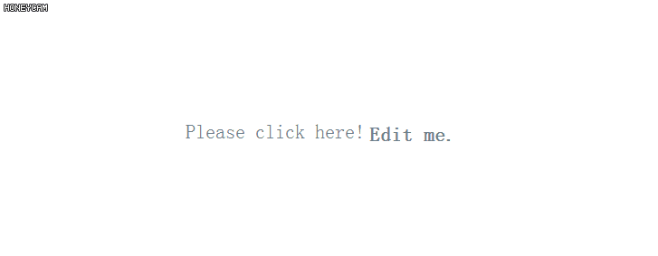
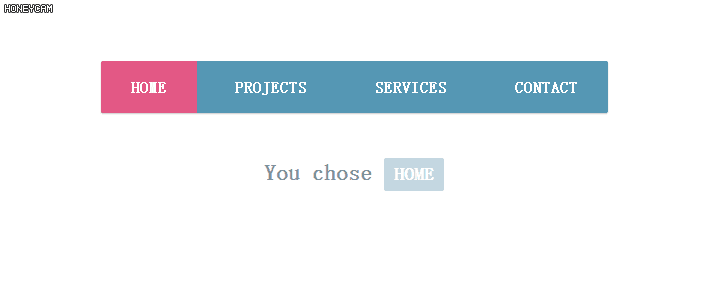
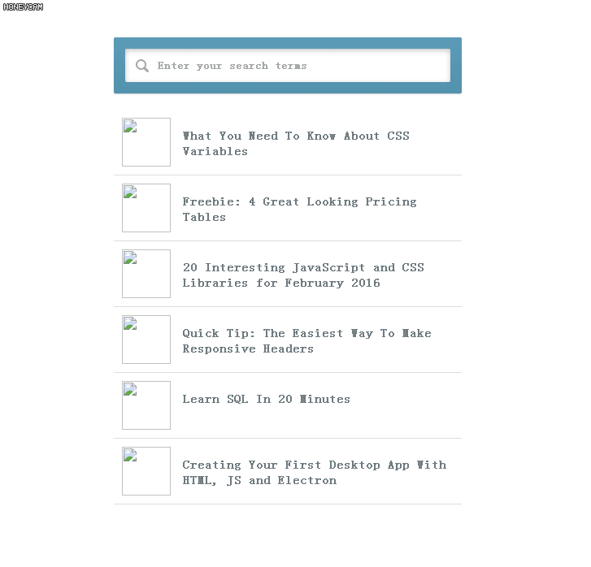
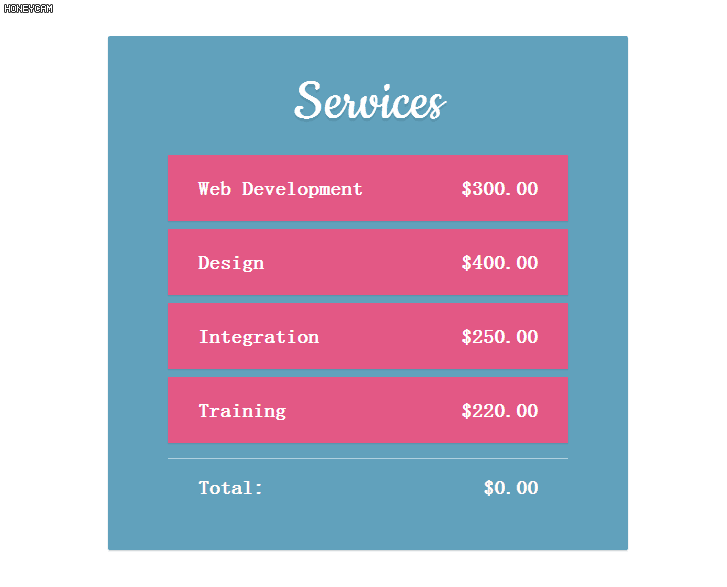
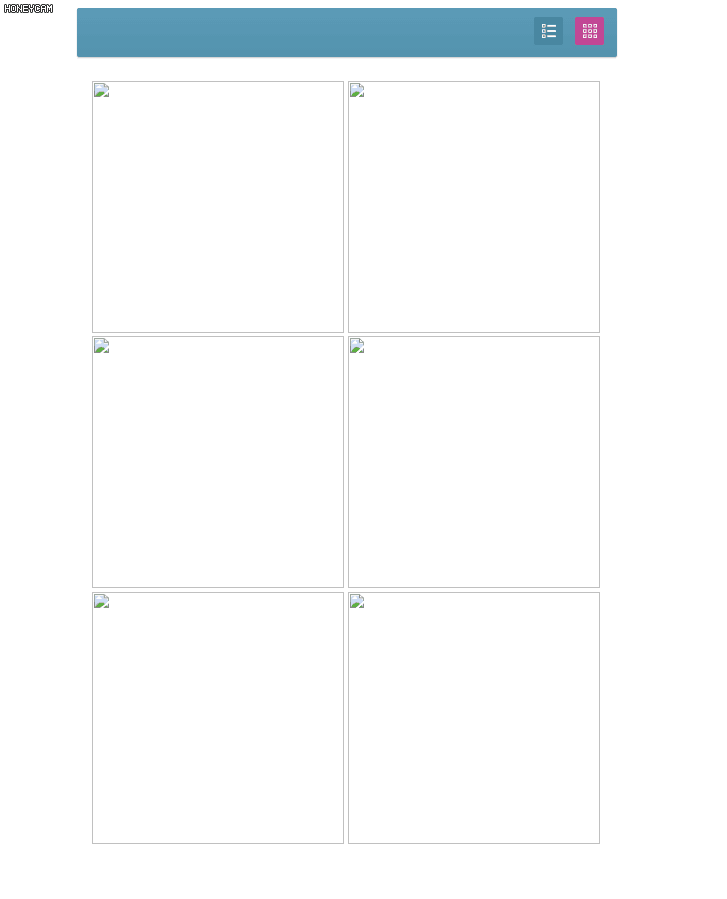

## **five-example-of-vuejs**

### vuejs_of_Internal_editor



### vuejs_of_Navigation



### vuejs_of_Search




##### Vuejs自定义过滤器filter

```javascript
Vue.filter('searchFor', function (value, searchString) {

    // Define a custom filter called "searchFor".
    // The first parameter to this function is the data that is to be filtered.
    // The second is the string we will be searching for.

    var result = [];

    if(!searchString){
        return value;
    }

    searchString = searchString.trim().toLowerCase();

    result = value.filter(function(item){
        if(item.title.toLowerCase().indexOf(searchString) !== -1){
            return item;
        }
    })

    // Return an array with the filtered data.

    return result;
})
```

### vuejs_of_Submit_From




### vuejs_of_Transform_layout


